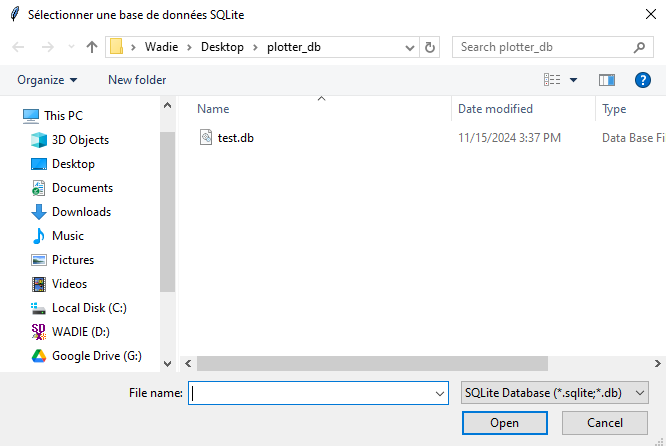

# WD UML Generator from SQLite

**WD UML Generator from SQLite** is a simple yet powerful tool designed to help developers and designers visualize the structure of an SQLite database in the form of a UML class diagram. Unlike tools like PhpMyAdmin, which offer easy-to-use interfaces for other databases, SQLite lacks a graphical design view, making it hard to visualize the relationships between tables. This tool bridges that gap by generating UML diagrams that can be easily understood and integrated into your project documentation.

As a developer, I created this tool to streamline my workflow and better understand the database structures of my projects. It’s ideal for developers who need to quickly visualize SQLite databases without the complexity of manual schema analysis.

<p align="center">
  
</p>

## Why Use WD UML Generator from SQLite?
This tool is especially useful for developers working with SQLite databases who need a quick, visual representation of their database schema. It can be difficult to work with raw database files in SQLite, especially when designing or analyzing complex database structures. With the **WD UML Generator from SQLite**, you can automatically generate UML class diagrams from your SQLite database, making it easier to understand relationships, foreign keys, and other aspects of your schema.

Whether you're building a new project, analyzing an existing database, or simply documenting your work, this tool provides a simple way to create useful visual diagrams of your database structure.

## Features
- **Database Visualization**: Automatically generates UML class diagrams from SQLite database files.
- **Easy to Use**: Just provide your SQLite file, and the tool will generate the diagram in seconds.
- **Helpful for Database Design**: Get a clear view of your database schema, including table relationships and foreign key constraints.
- **Open Source**: Developed with developers in mind, the project is open-source and can be modified or improved.
- **Portable**: Works with any SQLite database file (use the `test.db` file provided for easy testing).

## Installation

### Prerequisites
To run the WD UML Generator from SQLite, you need to install the following dependencies:

1. **SQLite3**: Make sure you have SQLite installed on your system. You can download it from [SQLite's official site](https://www.sqlite.org/download.html).
2. **Graphviz**: This package is used for plotting the UML diagrams.
   - For **Windows**, you can download Graphviz from [here](https://graphviz.gitlab.io/download/).
   - For **macOS**, use Homebrew:
     ```bash
     brew install graphviz
     ```
   - For **Linux**, use:
     ```bash
     sudo apt-get install graphviz
     ```

3. **Python Packages**: Install the required Python packages by running:
   ```bash
   pip install graphviz
   pip install sqlite3
   ```

### Running the Script
Once you have installed the dependencies, you can run the script locally:

1. **Clone or Download the Repository**: Download or clone the WD UML Generator from SQLite repository.
2. **Run the Script**: Navigate to the directory containing the script and execute:
   ```bash
   python uml-class-diagram-from-sqlite.py
   ```

## How to Use WD UML Generator from SQLite
1. **Select an SQLite Database File**: Use the `test.db` file provided or input your own SQLite database file.
2. **Generate UML Diagram**: The script will read the database structure and generate a UML class diagram of the tables and their relationships.

## Future Improvements
WD UML Generator from SQLite is still evolving! Future updates will include:
- **Improved Diagram Customization**: Allowing users to modify the appearance and layout of the generated UML diagrams.
- **Enhanced Foreign Key Visualization**: Better representation of foreign key relationships.
- **Support for Multiple Database Formats**: Potential support for other SQL databases like MySQL, PostgreSQL, etc.
- **Export Options**: Options to export diagrams in additional formats such as SVG, PDF, etc.

## Made with Love by Wadie Coder
This application was created with passion and care by **[wadiecoder.com](https://www.wadiecoder.com)**.

## Contact Me
If you have any questions, feedback, or suggestions, feel free to reach out to me via email:

**Email**: [wadie@wadiecoder.com](mailto:wadie@wadiecoder.com)

**Instagram**: [@wadie.coder](https://www.instagram.com/wadie.coder/)
